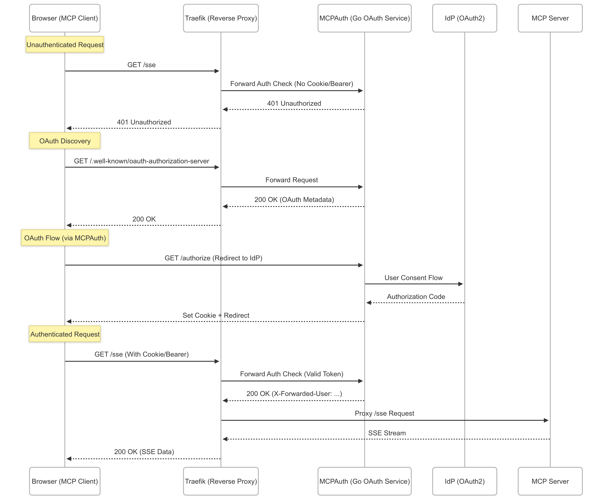

<div align="center">
  <h1>MCPAuth</h1>
  <p><strong>OAuth2 Forward Auth for Traefik with MCP Gateway Integration</strong></p>

  
  
  
  
</div>

---

## ✨ Features

- 🔐 OAuth2 authentication with PKCE via Traefik `forwardAuth`
- ⚡ Seamless integration with MCP Gateway SSE endpoints
- ✅ Email whitelisting for controlled access
- 🐳 Docker-ready, easy to deploy
- 🧪 Includes a Python-based test server


 

---

## 🚀 Quick Start

### 📦 Prerequisites

- Go 1.21+
- Traefik v2.x+
- An OAuth provider (e.g., Google, GitHub)

### 🛠️ Installation

```bash
git clone https://github.com/oidebrett/mcpauth
cd mcpauth
go mod tidy
```

### 🔧 Configuration

Use flags or environment variables:

| Variable         | Default   | Description                              |
|------------------|-----------|------------------------------------------|
| `PORT`           | `11000`   | Port for the auth server                 |
| `PROTECTED_PATH` | `/sse`    | Protected endpoint path                  |
| `OAUTH_DOMAIN`   | *(none)*  | OAuth issuer domain                      |
| `CLIENT_ID`      | *(none)*  | OAuth client ID                          |
| `CLIENT_SECRET`  | *(none)*  | OAuth client secret                      |
| `ALLOWED_EMAILS` | *(none)*  | Comma-separated list of allowed emails   |
| `LOG_LEVEL`      | `1`       | 0=debug, 1=info, 2=minimal               |

```bash
go run cmd/main.go -port=11000 -oauthDomain=your-domain.com
```

---

## 🐳 Docker Deployment

### Basic Docker Compose

```yaml
services:
  mcpauth:
    build: .
    environment:
      - PORT=11000
      - CLIENT_ID=${CLIENT_ID}
      - CLIENT_SECRET=${CLIENT_SECRET}
    ports:
      - "11000:11000"
```

---

## 🔐 Traefik Integration

### ForwardAuth Middleware

```yaml
http:
  middlewares:
    mcp-auth:
      forwardAuth:
        address: "http://mcpauth:11000/sse"
        authResponseHeaders:
          - "X-Forwarded-User"
```

### Attach to a Router

```yaml
labels:
  - "traefik.http.routers.myapp.middlewares=mcp-auth@file"
```

---

## 🧪 Testing

### Run Included Test Server

```bash
cd test_mcp_server
python3 -m venv venv
source venv/bin/activate
pip install -r requirements.txt
python mcp-server-sse.py
```

### With `curl`

```bash
curl -i http://localhost:11000/health
curl -i http://localhost:11000/sse
```

---

## 🧱 Middleware Chain (Traefik)

Apply middlewares in this order:

1. `mcp-cors-headers`
2. `redirect-regex`
3. `mcp-auth`

Example dynamic config:

```yaml
http:
  middlewares:
    mcp-cors-headers:
      headers:
        accessControlAllowCredentials: true
        accessControlAllowHeaders:
          - Authorization
          - Content-Type
          - mcp-protocol-version
        accessControlAllowMethods:
          - GET
          - POST
          - OPTIONS
        accessControlAllowOriginList:
          - "*"
        accessControlMaxAge: 86400
        addVaryHeader: true

    redirect-regex:
      redirectRegex:
        regex: "^https://([a-z0-9-]+)\\.yourdomain\\.com/\\.well-known/oauth-authorization-server"
        replacement: "https://oauth.yourdomain.com/.well-known/oauth-authorization-server"
        permanent: true

    mcp-auth:
      forwardAuth:
        address: "http://mcpauth:11000/sse"
        authResponseHeaders:
          - X-Forwarded-User
```

---

## 🧠 Middleware Manager Support

This project supports [middleware-manager](https://github.com/hhftechnology/middleware-manager).

Example `templates.yml`:

```yaml
middlewares:
  - id: mcp-auth
    name: MCP Authentication
    type: forwardAuth
    config:
      address: "http://mcpauth:11000/sse"
      authResponseHeaders:
        - "X-Forwarded-User"

  - id: mcp-cors-headers
    name: MCP CORS Headers
    type: headers
    config:
      accessControlAllowMethods:
        - GET
        - POST
        - OPTIONS
      accessControlAllowOriginList:
        - "*"
      accessControlAllowHeaders:
        - Authorization
        - Content-Type
        - mcp-protocol-version
      accessControlMaxAge: 86400
      accessControlAllowCredentials: true
      addVaryHeader: true

  - id: redirect-regex
    name: Regex Redirect
    type: redirectregex
    config:
      regex: "^https://([a-z0-9-]+)\\.yourdomain\\.com/\\.well-known/oauth-authorization-server"
      replacement: "https://oauth.yourdomain.com/.well-known/oauth-authorization-server"
      permanent: true
```

---

## 📜 License

Licensed under the [GNU General Public License v3.0](LICENSE).

```

